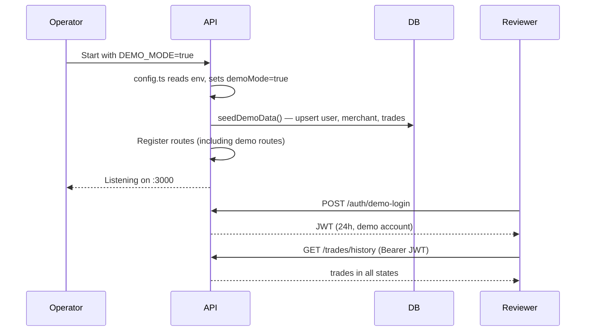

# Design Document: Demo Mode

## Overview

Demo Mode is a feature-flag-gated capability that enables app store reviewers (Apple and Google) to exercise the full MicoPay application flow without real wallets, credentials, or prior setup. When `DEMO_MODE=true`, the API boots with a deterministic seed account, a pre-seeded merchant, and pre-created trades in every relevant lifecycle state. The frontend detects the flag via a status endpoint and renders a non-intrusive banner on every page.

The feature is designed around a single invariant: **zero demo behaviour leaks into production**. Every demo-specific code path is gated behind `config.demoMode`, which is forced to `false` when `NODE_ENV=production`.

### Goals

- Allow app store reviewers to complete the full review flow in under 5 minutes with no manual setup.
- Ensure demo mode is completely invisible in production builds.
- Keep the implementation minimal and additive — no changes to existing production code paths.

### Non-Goals

- Supporting multiple simultaneous demo accounts.
- Persisting reviewer session state across API restarts.
- Providing a demo mode for the Bazaar or x402 payment flows (those are separate features).

---

## Architecture

The feature spans three layers:

```
┌─────────────────────────────────────────────────────────────┐
│  Frontend (apps/web/src)                                    │
│  ┌──────────────────┐  ┌──────────────────────────────────┐ │
│  │  DemoBanner.tsx  │  │  Login page (credential prefill) │ │
│  └──────────────────┘  └──────────────────────────────────┘ │
│  useDemoStatus() hook — calls GET /api/v1/demo/status       │
└─────────────────────────────────────────────────────────────┘
                          │ HTTP
┌─────────────────────────────────────────────────────────────┐
│  API (apps/api/src)                                         │
│  ┌──────────────────────────────────────────────────────┐   │
│  │  config.ts  — demoMode boolean (env-derived)         │   │
│  └──────────────────────────────────────────────────────┘   │
│  ┌──────────────────────────────────────────────────────┐   │
│  │  routes/demo.ts  — GET /api/v1/demo/status           │   │
│  │                    POST /auth/demo-login              │   │
│  └──────────────────────────────────────────────────────┘   │
│  ┌──────────────────────────────────────────────────────┐   │
│  │  scripts/seed.ts — seedDemoData() (idempotent)       │   │
│  └──────────────────────────────────────────────────────┘   │
└─────────────────────────────────────────────────────────────┘
                          │ SQL
┌─────────────────────────────────────────────────────────────┐
│  PostgreSQL                                                 │
│  users · wallets · merchants · trades                       │
└─────────────────────────────────────────────────────────────┘
```

### Startup Sequence (demo mode enabled)



---

## Components and Interfaces

### 1. Config Module (`apps/api/src/config.ts`)

Add `demoMode` to the existing config object:

```typescript
demoMode: process.env.NODE_ENV === 'production'
  ? false  // production safety override
  : process.env.DEMO_MODE === 'true',
```

If `NODE_ENV=production` and `DEMO_MODE=true`, the API logs a warning and forces `demoMode=false`.

### 2. Demo Seed (`apps/api/src/scripts/seed.ts`)

A new exported function `seedDemoData()` is called from `apps/api/src/index.ts` during startup when `config.demoMode === true`. It is **not** called by the existing `main()` seed script to avoid polluting non-demo seeds.

The function uses `INSERT ... ON CONFLICT DO UPDATE` (upsert) throughout, making it safe to call on every restart.

### 3. Demo Routes (`apps/api/src/routes/demo.ts`)

The existing `demo.ts` file currently contains the `POST /api/v1/demo/run` endpoint (the x402 on-chain demo). Two new routes are added to the same file:

- `GET /api/v1/demo/status` — public, no auth, returns `{ demo_mode: boolean }`
- `POST /auth/demo-login` — returns 404 when `demoMode=false`, returns JWT when `demoMode=true`

### 4. Frontend Hook (`apps/web/src/hooks/useDemoStatus.ts`)

A React hook that fetches `GET /api/v1/demo/status` once on mount and returns `{ isDemoMode: boolean, loading: boolean }`. The result is stored in React state and passed down via props (or a lightweight context if the app grows).

### 5. Demo Banner (`apps/web/src/components/DemoBanner.tsx`)

A fixed-position bar rendered at the very top of the viewport (above the existing header) when `isDemoMode=true`. It uses a distinct amber/yellow colour to stand out without clashing with the existing green primary palette.

### 6. Login Screen Credential Prefill

The existing login page (or whichever page handles authentication) receives `isDemoMode` as a prop. When true, it pre-populates the credential fields with the documented demo values and shows a label.

### 7. Reviewer Guide (`docs/REVIEWER_GUIDE.md`)

A standalone Markdown file documenting credentials, click path, and expected outcomes. Created as part of this feature.

---

## Data Models

### Demo Account (fixed constants)

These values are hardcoded in `seed.ts` and documented in `REVIEWER_GUIDE.md`:

```typescript
const DEMO_USER = {
  username: "demo_reviewer",
  stellar_address: "GDEMOREVIEWER000000000000000000000000000000000000000000001",
  // password stored as bcrypt hash in DB; plaintext documented in REVIEWER_GUIDE.md
  password: "MicoPay-Review-2025",
};

const DEMO_MERCHANT_ID = "MERCH_DEMO_001";
```

> Note: The Stellar address above is illustrative. The actual value will be a valid 56-character Stellar public key generated deterministically for the demo account.

### Users Table (existing)

No schema changes. The demo user is inserted with a fixed `id` (UUID v5 derived from the demo stellar address) so upserts are stable.

### Merchants Table (existing)

No schema changes. The demo merchant is upserted with `id = 'MERCH_DEMO_001'`.

### Trades Table (existing)

No schema changes. Four demo trades are upserted with fixed UUIDs, one per required state:

| Fixed UUID suffix | Status      | Notes                                   |
| ----------------- | ----------- | --------------------------------------- |
| `demo-trade-0001` | `pending`   | Awaiting lock                           |
| `demo-trade-0002` | `funded`    | Maps to `locked` in the existing schema |
| `demo-trade-0003` | `completed` | `completed_at` set, secrets cleared     |
| `demo-trade-0004` | `cancelled` | `secret_enc` and `secret_nonce` cleared |

> The requirements use `funded` as a trade state; the existing schema uses `locked`. The seed will use `locked` to match the actual DB enum. The Reviewer Guide will refer to it as "funded/locked".

### JWT Payload (demo login)

The JWT issued by `POST /auth/demo-login` uses the same payload shape as the standard auth flow:

```typescript
{
  id: string;
  stellar_address: string;
}
```

It is signed with the same `config.jwtSecret` and expires in `24h` (matching `config.jwtExpiry`).

### API Response Shapes

**`GET /api/v1/demo/status`**

```json
{ "demo_mode": true }
```

**`POST /auth/demo-login` (success)**

```json
{
  "token": "<jwt>",
  "user": { "id": "...", "username": "demo_reviewer", "stellar_address": "..." }
}
```

**`POST /auth/demo-login` (demo off)**

```
HTTP 404 Not Found
```

---

## Correctness Properties

_A property is a characteristic or behavior that should hold true across all valid executions of a system — essentially, a formal statement about what the system should do. Properties serve as the bridge between human-readable specifications and machine-verifiable correctness guarantees._

### Property 1: demoMode derivation is correct for all env inputs

_For any_ string value of the `DEMO_MODE` environment variable, `config.demoMode` must be `true` if and only if the value is exactly `"true"` **and** `NODE_ENV` is not `"production"`. For all other values (absent, `"false"`, `"1"`, any arbitrary string) or when `NODE_ENV=production`, `config.demoMode` must be `false`.

**Validates: Requirements 1.1, 1.2, 9.1**

---

### Property 2: Seed idempotence

_For any_ number of consecutive calls to `seedDemoData()` (N ≥ 1) against the same database, the resulting set of demo rows (user, merchant, trades) must be identical after each call — same count, same primary keys, same field values. No duplicate records may be created.

**Validates: Requirements 2.5**

---

### Property 3: Demo JWT is accepted by all authenticated routes

_For any_ API route that requires a valid JWT (i.e., uses `authMiddleware`), a token issued by `POST /auth/demo-login` (when `demoMode=true`) must be accepted with the same result as a token issued by the standard auth flow for the same user.

**Validates: Requirements 3.3**

---

### Property 4: demo-login always returns 404 when demoMode is false

_For any_ HTTP request to `POST /auth/demo-login` — regardless of request body, headers, or other parameters — when `config.demoMode` is `false`, the response status must be `404`.

**Validates: Requirements 3.2, 9.2**

---

### Property 5: Demo banner is present on every page when demo mode is active

_For any_ page component in the Web_App, when `isDemoMode` is `true`, the rendered output must contain the `DemoBanner` component. When `isDemoMode` is `false`, the `DemoBanner` must be absent from the rendered output of every page.

**Validates: Requirements 5.2, 5.5**

---

## Error Handling

### API Layer

| Scenario                                             | Behaviour                                                                                   |
| ---------------------------------------------------- | ------------------------------------------------------------------------------------------- |
| `POST /auth/demo-login` called when `demoMode=false` | Return `404 Not Found` (no body needed; must not leak that the route exists)                |
| `seedDemoData()` fails (DB unavailable)              | Propagate the error — API startup should abort, same as the existing seed failure behaviour |
| `GET /api/v1/demo/status` called when DB is down     | The endpoint reads only from `config.demoMode` (in-memory), so it should still return `200` |
| `NODE_ENV=production` + `DEMO_MODE=true`             | Log `[WARN] DEMO_MODE=true is ignored in production` and continue with `demoMode=false`     |

### Frontend Layer

| Scenario                                           | Behaviour                                                                                      |
| -------------------------------------------------- | ---------------------------------------------------------------------------------------------- |
| `GET /api/v1/demo/status` network error            | Default to `isDemoMode=false` (fail safe — never show demo UI in production if the call fails) |
| `GET /api/v1/demo/status` returns unexpected shape | Treat as `demo_mode: false`                                                                    |
| Demo credentials prefill fails to render           | Fall back to empty fields; do not block login                                                  |

---

## Testing Strategy

### Dual Testing Approach

Both unit tests and property-based tests are required. They are complementary:

- **Unit tests** cover specific examples, integration points, and edge cases.
- **Property tests** verify universal invariants across many generated inputs.

### Property-Based Testing Library

**Backend (TypeScript/Node):** [`fast-check`](https://github.com/dubzzz/fast-check)
**Frontend (React/TypeScript):** [`fast-check`](https://github.com/dubzzz/fast-check) with `@testing-library/react`

Each property test must run a minimum of **100 iterations**.

Each property test must include a comment tag in the format:

```
// Feature: demo-mode, Property <N>: <property_text>
```

### Property Tests

**Property 1 — demoMode derivation**

```
// Feature: demo-mode, Property 1: demoMode is true iff DEMO_MODE==="true" and NODE_ENV!=="production"
fc.assert(fc.property(
  fc.string(),          // arbitrary DEMO_MODE value
  fc.string(),          // arbitrary NODE_ENV value
  (demoModeEnv, nodeEnv) => {
    const result = deriveDemoMode(demoModeEnv, nodeEnv);
    const expected = demoModeEnv === 'true' && nodeEnv !== 'production';
    return result === expected;
  }
), { numRuns: 100 });
```

**Property 2 — Seed idempotence**

```
// Feature: demo-mode, Property 2: calling seedDemoData() N times produces the same DB state
// Run seedDemoData() twice, compare row counts and PKs for demo records
```

**Property 3 — Demo JWT accepted by all auth routes**

```
// Feature: demo-mode, Property 3: demo JWT is accepted by any authenticated route
// For each authenticated route in the route registry, inject demo JWT and verify non-401 response
```

**Property 4 — demo-login returns 404 when demoMode=false**

```
// Feature: demo-mode, Property 4: POST /auth/demo-login always 404 when demoMode=false
fc.assert(fc.property(
  fc.record({ email: fc.string(), password: fc.string() }),  // arbitrary body
  async (body) => {
    const res = await app.inject({ method: 'POST', url: '/auth/demo-login', payload: body });
    return res.statusCode === 404;
  }
), { numRuns: 100 });
```

**Property 5 — Demo banner on every page**

```
// Feature: demo-mode, Property 5: DemoBanner present on every page when isDemoMode=true
// For each page component, render with isDemoMode=true and assert DemoBanner is in the tree
```

### Unit Tests

Focus on specific examples and edge cases:

- `config.demoMode` is `false` when `DEMO_MODE` is absent
- `config.demoMode` is `false` when `NODE_ENV=production` even if `DEMO_MODE=true` (with warning log)
- `GET /api/v1/demo/status` returns `{ demo_mode: true }` when `demoMode=true`
- `GET /api/v1/demo/status` returns `{ demo_mode: false }` when `demoMode=false`
- `GET /api/v1/demo/status` returns `200` without an Authorization header
- `POST /auth/demo-login` returns a JWT with `exp - iat <= 86400`
- After `seedDemoData()`, the demo user exists with the fixed stellar address
- After `seedDemoData()`, at least one trade exists in each of: `pending`, `locked`, `completed`, `cancelled`
- After `seedDemoData()` with `demoMode=false`, no demo records are written
- `docs/REVIEWER_GUIDE.md` exists and contains the demo credentials section
- Login component renders with pre-filled credentials when `isDemoMode=true`
- Login component renders with empty fields when `isDemoMode=false`
- `DemoBanner` renders the expected review-session message
